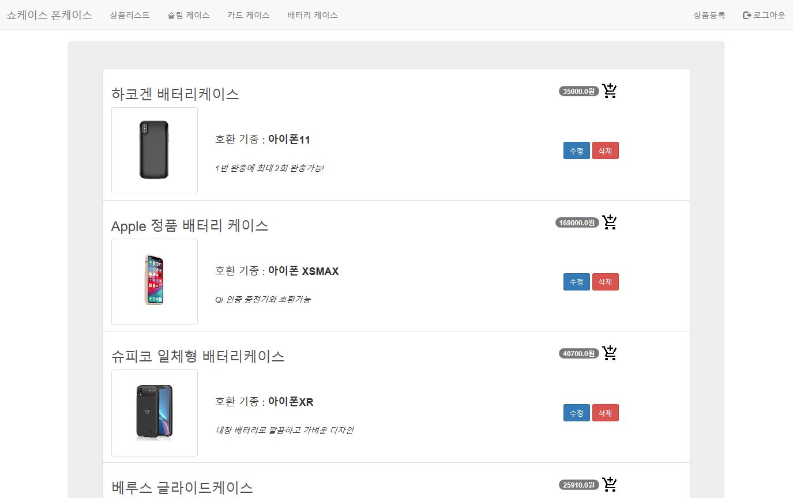

> ### 참고서적
- ### JSP 웹 쇼핑몰 프로젝트 프로그래밍(JSP WEB Programming) 
	- https://www.udemy.com/course/jsp-web-programming/
  
<br>

> ### 목차
### 1.개발환경 구축하기
- [1.개발환경 구축하기](#1.개발환경 구축하기)
	- [개발환경](#개발환경)
	- [Cafe24 구성](#Cafe24-구성)
	- [학습 및 개발기간](#학습-및-개발기간)

### 2.주요 메소드 및 기능
- [2.주요 메소드 및 기능](#2.주요-메소드-및-기능)
	- [회원가입 및 로그인](#회원가입-및-로그인)
	- [상품 등록](#상품-등록)
	- [장바구니 담기, 결제하기](#장바구니-담기,-결제하기)
	- [커넥션 풀 설정](#커넥션-풀-설정)

### 3.구조
- [3.구조](#3.구조)
	- [디렉토리](#디렉토리)
	- [테이블](#테이블)
		- [Cart](#Cart)
		- [Employee](#Employee)
		- [Customer](#Customer)
		- [CustOrder](#CustOrder)
		- [Product](#Product)
 

<br><br>
<br><br>


## 1.개발환경 구축하기
### 개발환경
* Eclipse IDE 2020-03
* Apache-tomcat-9.0.33
* jdk-14
* (oracleDB & Toad) -> MariaDB
* External Jar :
	* mariadb-java-client-2.5.4
	* mariadb-java-client-2.6.0-javadoc
	* jstl
	* standard

<br>

### Cafe24 구성
* Tomcat 8.0.x
* JSP 2.3
* Servlet 3.1
* Open JDK 1.8.x
* MariaDB 10.1.x UTF-8

<br>

### 학습 및 개발기간
- Jsp Model2 방식으로 CRUD기능을 구현한 간단한 쇼핑몰을 개발하였습니다.
* 2020-03-20 ~ 2020-03-29
* hosting url : http://aa5505.cafe24.com/OnlinePhonecaseShopping/Index.jsp
* git repo : https://github.com/kim-goro/ShowcasePhonecase    

<br><br>
<br><br>


## 2.주요 메소드 및 기능
### 회원가입 및 로그인

```javascript
// RegisterForm.jsp
<script>
	function openUser(option) {
		document.getElementById("custInfo").style.display = option;
	}
	function MsgLoginValid() {
		var form = document.RegistForm;
		// validate null value
		if (document.getElementById("email").value == ""
				|| document.getElementById("pwd").value == ""
				|| document.getElementById("userName").value == "") {
			$("#myModal").modal("show");
			return;
		} else {
			form.action = "RegisterCon.do";
			form.submit();
		}
	}
	$("#myModal").on("shown.bs.modal", function() {
		$("#myInput").trigger("focus");
	});
</script>
```
`RegiterForm.jsp`에서 작성한 Form은 간단한 Validation을 거친 후 `RegisterCon.do` 서블릿으로 넘겨줍니다.  

<br>

```java
// RegisterCon.java
if (category.equals("Customer")) {
	String address = request.getParameter("address");
	String postalCode = request.getParameter("postalCode");
	String innerSql = "INSERT INTO Customer " + " (customerId, userName, userpwd, address, postalCode) values (?,?,?,?,?)";
	pstmt = con.prepareStatement(innerSql);
	pstmt.setString(1, email);
	pstmt.setString(2, userName);
	pstmt.setString(3, pwd);
	pstmt.setString(4, address);
	pstmt.setString(5, postalCode);
	int chk = pstmt.executeUpdate();
	if (chk == 0) {
		//가입 실패 시
		request.setAttribute("Msg", "fail");
		nextPage = "/RegisterForm.jsp";
	} else {
		Customer customer = new Customer();
		customer.setCustomerId(email);
		customer.setUserName(userName);
		customer.setUserPwd(pwd);
		customer.setAddress(address);
		customer.setPostalCode(postalCode);
		// session
		HttpSession session = request.getSession();
		session.setAttribute("userType", "customer");
		session.setAttribute("customer", customer);
		nextPage = "/RegisterCust.jsp";
	}
```
POST로 넘겨받은 `category`를 통해 Customer과 Employee로 구분합니다.  
쿼리문 실패 시 `Msg`를 반환하고 성공 시 `HttpSession`을 저장합니다.  

<br>

### 상품 등록


```java
// EmpProdCon.java
if(mode.equals("new")) {
	 itemName = request.getParameter("itemName");
	 category = request.getParameter("category");
	 device = request.getParameter("device");
	 content = request.getParameter("content");
	 quantity = Integer.parseInt(request.getParameter("quantity"));
	 price = Double.parseDouble(request.getParameter("price"));
	 productDao.addRow( itemName, category, device, quantity, price, content);
	System.out.println("EmpProdCon.do : "+category+"에 '"+itemName+"'등록을 완료하였습니다.");
	response.sendRedirect("ProdListCon.do");
// delete data
}else if(mode.equals("del")) {
	itemId = Integer.parseInt(request.getParameter("itemId"));
	category = request.getParameter("category");
	productDao.delRow(itemId);
	System.out.println("EmpProdCon.do : "+category+"에 '"+itemId+"'번째 품목을 삭제하였습니다.");
	request.setAttribute(category, null);
	getServletContext().getRequestDispatcher("/ProdListCon.do").forward(request, response);
// update data
}else if(mode.equals("edit")) {
	 itemId = Integer.parseInt(request.getParameter("itemId"));
	 itemName = request.getParameter("itemName");
	 category = request.getParameter("category");
	 device = request.getParameter("device");
	 content = request.getParameter("content");
	 quantity = Integer.parseInt(request.getParameter("quantity"));
	 price = Double.parseDouble(request.getParameter("price"));
	 productDao.updateRow( itemId, itemName, category, device, quantity, price, content);
	request.setAttribute(category, null);
	System.out.println("EmpProdCon.do : "+category+"에 '"+itemName+"'수정을 완료하였습니다.");
	getServletContext().getRequestDispatcher("/ProdListCon.do?category="+category).forward(request, response);
// to search data for edit-page 
}else if(mode.equals("search")) {
	itemId = Integer.parseInt(request.getParameter("itemId"));
	Product product = productDao.searchProduct(itemId);
	request.setAttribute("mode", "edit");   //  should be changed to edit mode
	request.setAttribute("product", product);
	System.out.println("EmpProdCon.do : '"+itemName+"'검색을 완료하였습니다.");
	getServletContext().getRequestDispatcher("/EmpProdForm.jsp").forward(request, response);
}	 
```
`EmpProdForm.jsp`에서 Request를 받은 `EmpProdCon.do`에서 전달받은 `mod`를 확인하여 신규, 삭제, 수정, 검색을 실행합니다.  

<br>

### 장바구니 담기, 결제하기

```javascript
// ProdList.jsp
<script>
	// 카트에 담기
	function addCart(itemId, itemName) {
		document.getElementById('modal_item_title').innerHTML = itemName;
		document.cartForm.itemId.value = itemId;
		$('#myModal').modal('show');
		return;
	}
	// 확인문 띄우기
	function submitCart() {
		$('#myModal').modal('toggle');
		document.cartForm.submit();
	}
	$('#myModal').on('shown.bs.modal', function() {
		$('#myInput').trigger('focus')
	})
	// form을 edit info로
	function moveEditPage(itemId, mode) {
		var form = document.listForm;
		form.mode.value = mode;
		form.itemId.value = itemId;
		form.submit();
	}
</script>
```
```java
// CartCon.java
protected void doGet(HttpServletRequest request, HttpServletResponse response) throws ServletException, IOException {
	request.setCharacterEncoding("UTF-8");
	String category = request.getParameter("category");
	String customerId = request.getParameter("customerId");
	String itemId = request.getParameter("itemId");
	ProductDAO productDao = new ProductDAO();
	Product product = new Product();
	try {
		product = productDao.searchProduct(itemId);
		System.out.println("CartCon.do : "+product.getItemName()+"의 재고가 "+product.getQuantity()+"개 남았습니다.");
	} catch (Exception e) {
		e.printStackTrace();
	}
	// add to cart
	CartDAO cartDao = new CartDAO();
	try {
		cartDao.addRow(product.getItemId(), product.getItemName(), customerId, product.getDevice(), 1, product.getPrice());
		System.out.println("CartCon.do : "+category+"에 "+product.getItemName()+"를 카트에 담았습니다.");
	} catch (Exception e) {
		e.printStackTrace();
	}
	request.setAttribute("category", null);
	getServletContext().getRequestDispatcher("/ProdListCon.do?category="+category).forward(request, response);
}

```
`ProdList.jsp`에서 출력된 상품의 장바구니 버튼을 누르면 확인창을 띄우고 `CartCon.do`에 id = `cartForm`의 `itemId`을 넘겨줍니다. 
<br>


```java
// MyCartCon.java
public ArrayList<CustOrder> listAllOrder() throws Exception {
	ArrayList<CustOrder> orderList = new ArrayList<CustOrder>();
	try {
		getCon();
		String sql = "SELECT o.orderID, o.itemId, o.customerId, o.device, o.quantity, o.price, o.orderStatus, o.orderdate, p.itemName "
				+ " FROM CustOrder o, Product p " + " WHERE o.itemId = p.itemId " + " ORDER BY o.orderId ASC";
		pstmt = con.prepareStatement(sql);
		rs = pstmt.executeQuery();
		while (rs.next()) {
			CustOrder order = new CustOrder();
			order.setOrderId(rs.getInt(1));
			order.setItemId(rs.getInt(2));
			order.setCustomerId(rs.getString(3));
			order.setDevice(rs.getString(4));
			order.setQuantity(rs.getInt(5));
			order.setPrice(rs.getDouble(6));
			order.setOrderStatus(rs.getString(7));
			order.setItemName(rs.getString(9));
			orderList.add(order);
		}
		con.close();
	} catch (Exception e) {
		e.printStackTrace();
	}
	return orderList;
	}
```

장바구니 탭을 누르면 `MyCartCon.do`에서  `CustOrderDAO` 쿼리문을 통해 장바구니 리스트를 가져옵니다.  

<br>


```java
// CustOrderDAO.java
public void orderAllItems(String customerId) throws Exception {
	try {
		getCon();
		String sql = "SELECT itemId, device, quantity, price FROM Cart WHERE customerId ='" + customerId
				+ "' ORDER BY cartNo ASC";
		pstmt = con.prepareStatement(sql);
		rs = pstmt.executeQuery();
		System.out.print("Error1");
		while (rs.next()) {
			System.out.print("Error2");
			String innerSql = "INSERT INTO CustOrder (itemId,customerId,device,quantity,price,orderStatus,Orderdate) "
					+ "values (?,'" + customerId + "',?,?,?,'"
							+ "Order Placed',now())";
			pstmt = con.prepareStatement(innerSql);
			pstmt.setInt(1, rs.getInt(1));
			pstmt.setString(2, rs.getString(2));
			pstmt.setInt(3, rs.getInt(3));
			pstmt.setDouble(4, rs.getDouble(4));
			pstmt.executeUpdate();
			con.close();
			System.out.print("Error3");
		}
		con.close();
	} catch (Exception e) {
		e.printStackTrace();
	}
}
```
`결제하기` 버튼을 누르면 `CustomerId`에 해당하는 `Cart`의 모든 쿼리셋을 지우고 `CustOrder`에 삽입합니다.

<br>

### 커넥션 풀 설정
```Java
//server.xml : Connection pool
<Context docBase="OnlinePhonecaseShopping" path="/OnlinePhonecaseShopping" reloadable="true" source="org.eclipse.jst.jee.server:OnlinePhonecaseShopping">
      <!-- <Resource 
      name="jdbc/pool" 
      auth="Container" 
      type="javax.sql.DataSource"
    factory="org.apache.tomcat.dbcp.dbcp2.BasicDataSourceFactory"
    driverClassName="org.mariadb.jdbc.Driver"
    url="jdbc:mariadb://localhost:3306/*?autoReconnect=true"
    username="*" 
    password="*" 
    maxActive="100" 
    maxIdle="30" 
    maxWait="10000"
    removeAbandoned="true" 
    removeAbandonedTimeout="60"/>  -->
    <Resource 
      	name="jdbc/pool" 
 		type="javax.sql.DataSource"
 		auth="Container"
 		maxActive="30"
 		maxIdle="3"
 		maxWait="3000"
 		username="root"
 		password="1234"
 		testOnBorrow="true"
 		driverClassName="com.mysql.cj.jdbc.Driver"
 		url="jdbc:mysql://localhost:3306/phcase?serverTimezone=UTC"
 		/></Context>
```

<br><br>
<br><br>


## 3.구조
### 디렉토리
```
_OnlinePhonecaseShopping
|
├── _build
|   | 
|   └── _classes
|       | 
|       ├── _model
|       |   ├── Cart.class
|       |   ├── CartDAO.class
|       |   ├── Customer.class
|       |   ├── CustomerDAO.class
|       |   ├── CustOrder.class
|       |   ├── CustOrderDAO.class
|       |   ├── Employee.class
|       |   ├── EmployeeDAO.class 
|       |   ├── Product.class
|       |   └── ProductDAO.class
|       |
|       └── _control
|           ├── CartCon.class 
|           ├── CheckoutCon.class 
|           ├── DelCartCon.class
|           ├── EmpCustListCon.class
|           ├── EmpOrderListCon.class
|           ├── EmpProdCon.class 
|           ├── LoginCon.class
|           ├── LoginEmpCon.class 
|           ├── LogoutCon.class
|           ├── MyCartCon.class
|           ├── MyPageCon.class
|           ├── ProdListCon.class
|           ├── RegisterCon.class
|           └── RegisterModiCon.class
|
└── _WebContent
    └──_WEB-INF
       ├── CustList.jps
       ├── CustMode.jps
       ├── CustOrderList.jps 
       ├── EmpProdForm.jps 
       ├── Index.jps
       ├── Login.jps
       ├── LoginCustProd.jps
       ├── LoginEmpProd.jps
       ├── MyCart.jps 
       ├── MyPage.jps 
       ├── OrderList.jps 
       ├── ProdList.jps 
       ├── RegisterForm.jps
       ├── RegisterModi.jps
       ├── TopNav.jps 
       └── TopNavLogin.jps
```

### 테이블
> #### Cart
```sql
CREATE TABLE Cart(
	cartno int(11) NOT NULL AUTO INCREMENT,
	itemId int(11) NOT NULL,
	itemName varchar(100) NOT NULL,
	customerId varchar(100) NOT NULL,
	device varchar(100) NOT NULL,
	quantity int(11) DEFAULT '1',
	price double NOT NULL,
	PRIMARY KEY(cartno), 
	UNIQUE KEY(itemId),
	FOREIGN KEY (itemId) REFERENCES Product(itemId) ON UPDATE CASCADE
)
```

> #### Employee
```sql
CREATE TABLE Employee(
	empNo int(11) NOT NULL AUTO INCREMENT,
	employeeId varchar(60) NOT NULL,
	username varchar(30) NOT NULL,
	userpwd varchar(30) NOT NULL,
	PRIMARY KEY(empNo), 
	UNIQUE KEY(employeeId)
)
```

> #### Customer

```sql
CREATE TABLE Customer(
	customerNo int(11) NOT NULL AUTO INCREMENT,
	customerId varchar(60) NOT NULL,
	username varchar(30) NOT NULL,
	userpwd varchar(30) NOT NULL,
	address varchar(30) NOT NULL,
	postalCode varchar(30) NOT NULL,
	PRIMARY KEY(customerNo), 
	UNIQUE KEY(customerId)
)
```

> #### CustOrder

```sql
CREATE TABLE CustOrder(
	orderId int(11) NOT NULL AUTO INCREMENT,
	itemId int(11) NOT NULL,
	itemName varchar(100) NOT NULL,
	cutomerId varchar(100) NOT NULL,
	device varchar(100) NOT NULL,
	quantity int(11) NOT NULL,
	price int(20) NOT NULL,
	orderStatus varchar(100) NOT NULL,
	orderdate DATETIME DEFAULT CURRENT_TIMESTAMP,
	PRIMARY KEY(customerNo), 
	UNIQUE KEY(customerId),
	FOREIGN KEY (itemId) REFERENCES Product(itemId) ON UPDATE CASCADE
)
```

> #### Product

```sql
CREATE TABLE Product(
	itemId int(11) NOT NULL AUTO INCREMENT,
	itemName varchar(50) NOT NULL,
	category varchar(30) NOT NULL,
	device varchar(30) NOT NULL,
	quantity int(11) NOT NULL,
	price int(20) NOT NULL,
	content varchar(300) NOT NULL,
	PRIMARY KEY(itemId), 
	UNIQUE KEY(itemName)
)
```
